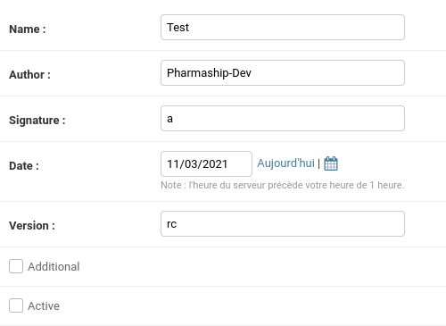
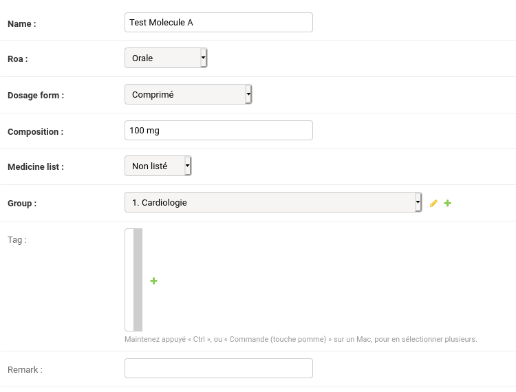
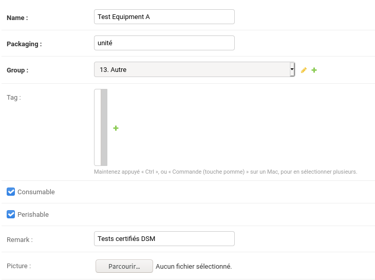
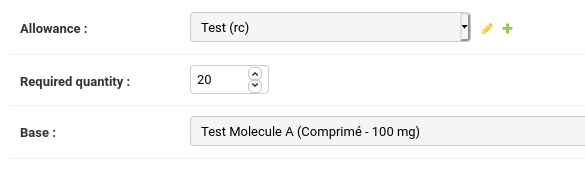
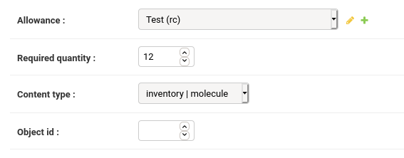

Create an Allowance Package
===========================

The base of the Pharmaship inventory system is contained in an Allowance.

An allowance is:

- a list of Molecule
- a list of Equipment
- different required quantities

The simplest way to create an Allowance is to use Django Admin pages.

To start the admin pages :

::

    python manage.py runserver

If necessary, create administration user credentials using the following
command:

::

    python manage.py createsuperuser

Then, access the administration page using any graphical webbrowser :
http://127.0.0.1:8000/admin

Create the ``Allowance`` object
-------------------------------

Access the creation form: http://127.0.0.1:8000/admin/inventory/allowance/add/

Fill up the form with your values.

``Signature`` must not be empty, using any value for now.

``Additional`` checkbox allows you to tell Pharmaship that any required
quantity is added.

Example :

  - You already have an item with a required quantity of 50.
  - The new required quantity is 100.

With additional ticked, total required quantity is **150**. Without, it is only
**100**.

The next step is to create differente ``Molecule`` and ``Equipment`` objects.

Create a ``Molecule`` object
----------------------------

Access the creation form: http://127.0.0.1:8000/admin/inventory/molecule/add/

Fill up the form with your values.

``Roa`` means "Route of Administration".

| The field ``Tag`` is not yet used.

Create an ``Equipment`` object
------------------------------

Access the creation form: http://127.0.0.1:8000/admin/inventory/equipment/add/

Fill up the form with your values.

``Consumable`` means the article related to this equipment will be able
to be "used".

``Perishable`` means the article related to this equipment must be
provided with an expiry date.

``Picture`` field allows you to add an helpful picture of the equipment to ease
inventory process for the non-initiated user and avoid any confusion.

| The field ``Tag`` is not yet used.

Create the required quantity objects
------------------------------------

Now that you have an ``Allowance``, few ``Molecule`` and ``Equipment`` objects,
you need to add required quantity information.

They are handled in different classes:

- ``MoleculeReqQty`` for main medicine inventory;
- ``EquipmentReqQty`` for main medical equipment inventory;
- ``RescueBagReqQty`` for rescue bags inventory;
- ``FirstAidKitReqQty`` for the first aid kits inventories;
- ``LaboratoryReqQty`` for laboratory inventory if applicable;
- ``TelemedicalReqQty`` for telemedical kit inventory if applicable.

For each, the behaviour of the creation form is the same for ``MoleculeReqQty``,
``EquipmentReqQty``, ``LaboratoryReqQty`` and ``TelemedicalReqQty``:

1. Select the Allowance in the dropdown list
2. Input the required quantity
3. Select the base object (ie: a Molecule object)

URL for required quantity creation:

- http://127.0.0.1:8000/admin/inventory/moleculereqqty/add/
- http://127.0.0.1:8000/admin/inventory/equipmentreqqty/add/
- http://127.0.0.1:8000/admin/inventory/laboratoryreqqty/add/
- http://127.0.0.1:8000/admin/inventory/telemedicalreqqty/add/

------------

For ``RescueBagReqQty`` and ``FirstAidKitReqQty``, the process is a little bit
different as you can refer to both molecule and equipment objects:

1. Select the Allowance in the dropdown list
2. Input the required quantity
3. Select the type of the base object (molecule or equipment)
4. Input the ID of the base object.

   *The ID can be found in the list page or in the link of an object. In
   example: http://127.0.0.1:8000/admin/inventory/equipment/* **139**

.. note::

   - ``RescueBagReqQty`` is applicable **for the whole** rescue bags (whatever
     you have one or two or more rescue bags). The articles and medicines are
     linked to a rescue bag through their location in the main inventory.

   - ``FirstAidKitReqQty`` is applicable **for each** first aid kit. It means if
     you have 10 first aid kits, then the required quantity is multiplied 10 times.

URL for required quantity creation:

- http://127.0.0.1:8000/admin/inventory/rescuebagreqqty/add/
- http://127.0.0.1:8000/admin/inventory/firstaidkitreqqty/add/

Export the allowance files
--------------------------

You need to know the ID of your allowance.

First run the following command and record the desired allowance ID:

::

    python manage.py export list

You should get a similar output:::

    INFO Allowances in database:
    INFO [ID]  NAME (VERSION)
    INFO [00]  Orphan (1)
    INFO [01]  Dotation A - 25 marins (12.0b)
    INFO [03]  GSMU (2018)
    INFO [04]  Marlink Telemed (0.1)
    INFO [05]  POCramé (0.1)
    INFO [08]  Test (rc)

Then run the following command:::

    python manage.py export allowance id <ID> <my_package_filename.tar>

*The exported package is a tar archive.*

The tar file should contain the following architecture:::

    - /
      - MANIFEST
      - package.yaml
      - inventory/
        - allowance.yaml
        - equipment_obj.yaml
        - equipment_reqqty.json
        - first_aid_kit_reqqty.json
        - laboratory_reqqty.json
        - molecule_obj.yaml
        - molecule_reqqty.json
        - rescue_bag_reqqty.json
        - telemediacal_reqqty.json
      - pictures/ (if any)
        - (all your pictures with slug-name)

Sign the allowance package
--------------------------

The Pharmaship archive comes with a dedicated script which barely sign the
package with armor (``gpg -s -a ...``) and output a ``.asc`` file.

::

    bin/pharmaship-sign <my_package_filename.tar>

.. note::

   - You *must* import your GPG signing private key first. See GPG man page.
   - The GPG "homedir" in the ``pharmaship-sign`` script is the ``bin`` folder.

Deploy your package
-------------------

Your ``.asc`` file is ready to be sent to the Pharmaship users
(see :doc:`import procedure </manual/installation/allowance>`)... provided you already :doc:`deployed your public key </dev/deploy_sign_pub_key>`.
