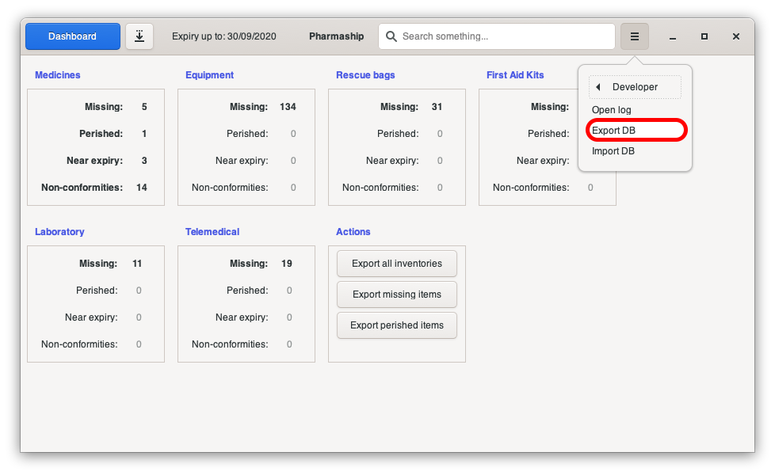
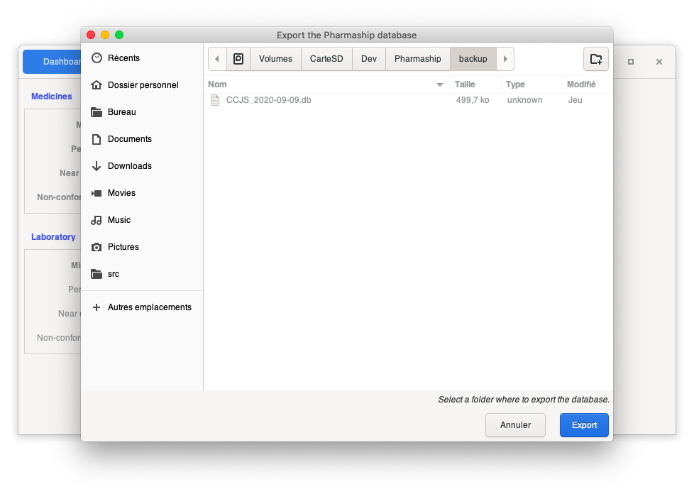
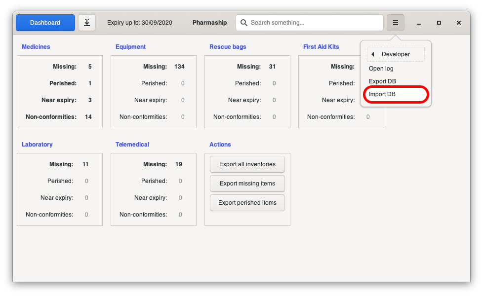

Backup and restore
------------------

Shall don't you want to full inventory again your hospital, better to use backup functionality after each inventory, or at least every month, or before any upgrade.

Export Data Base
~~~~~~~~~~~~~~~~

Export a database is very simple. From any software window, open *Configuration Menu* then *Developer* and click on *export DB*.

A sub-window is opening, asking you where to save your file, for instance, on Desktop, or in a dedicated backups folder.

Import Data Base
~~~~~~~~~~~~~~~~

Once you want to import a database backup, for example, if you have to install pharmaship on a new computer, or a new
version, simply go on *Configuration* menu, then *Developer* and click on *Import DB*

A sub-window is opening, asking you where to load your file from, select your backed up file.
Then validate on the confirmation Window.

.. Note:: In case of new installation of *Pharmaship*, there is absolutely no need for any kind of configuration. Once installation is done, directly recover your backup and simply check that there is no mistake in configuration.
