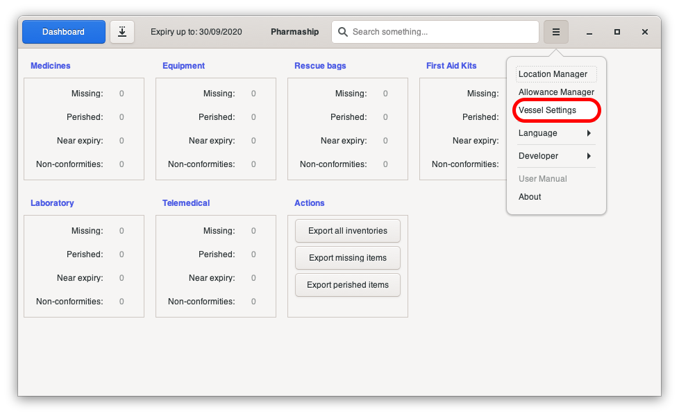
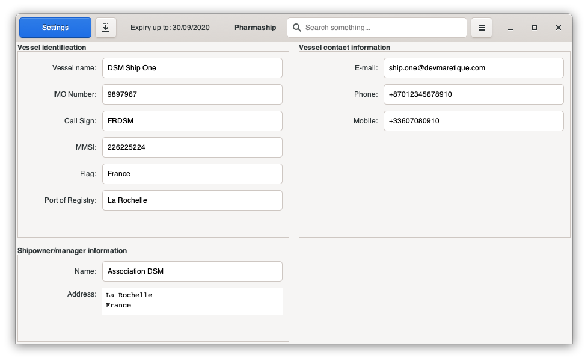
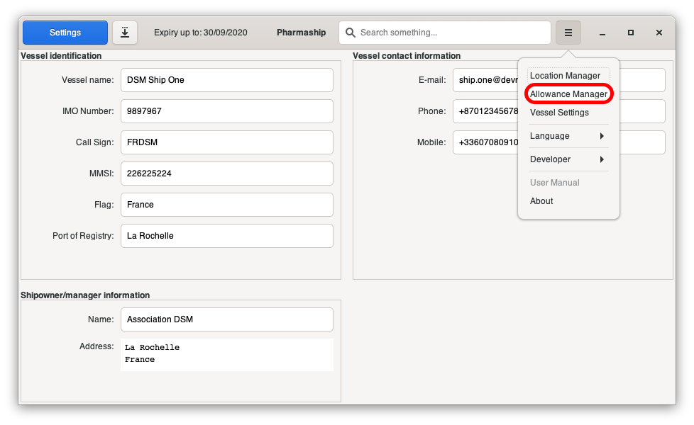
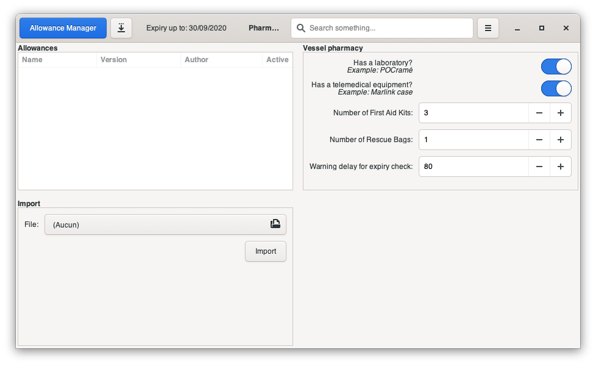

Installation & setup
--------------------

Depending on your system, you will have to use the following installer that you may find on `DSM website <https://www.dsm.com>`_ on page `Pharmaship <https://www.dsm.com/pharmaship>`_.

* **pharmaship_xx.xx.xx.exe** for Windows Operation System - Simply double-click on the application icon.
* **pharmaship_xx.xx.xx.deb** for Debian based systems - execute "dpkg -i pharmaship.xx.xx.xx.deb" in normal user console.
* **pharmaship_xx.xx.xx.dmg** for MacOS environment - Double click, then drag & drop Pharmaship icon to your application folder.

Once successfully installed, you will be able to execute it for the first time and set all parameters.

Configure your vessel
~~~~~~~~~~~~~~~~~~~~~

In any software window, open *Configuration Menu* then *Vessel Settings*.

Fill all fields there as it will be used on various area, such as your pdf exportation.
When modifying any value, bottom bar will appear with *save* or *cancel* button.
Click on *save* to record your changes.

Configure your allowances
~~~~~~~~~~~~~~~~~~~~~~~~~

In any software window, open *Configuration Menu* then *Allowance Manager*.

This configuration window is split in two columns, on the left, the top part shows allowance loaded for your vessel
when the bottom part shows import button to update allowance you have to use.

Allowances
++++++++++

You should have allowances packets in your possession, if not you may download some from `Pharmaship/Allowance <https://www.dsm.com/pharmaship/allowances>`_.
These files look like *A_type_version.tar.asc*, where *type* can be *GSMU* for instance, and *version* is the revision number.

.. note:: These files are encrypted, using GnuPG public and private keys for signature validation from authors of packets. This is to ensure origin of data, and prove its integrity.

Active column allows you to (de)activate any allowance you want, in order to check for example quantity and dotation of an other specific allowance.

Vessel pharmacy
+++++++++++++++

On the column, you will be able to (de)activate Laboratory and/or Telemedical equipment depending if your vessel is equipped, or not.
Then you need to specify how many first aid kit(s) and rescue bag(s) you have, they may be stow outside of vessel's pharmacy.
They usually are.

Finally, set-up the warning delay for pharmacy check. This is interval between when you need to order new medicines
in order to receive them before the old ones were expired.

.. warning:: Sailing with expired medicines is prohibited.

But don't throw expired medicines until you receive the good
one, it may save life ! Expired medicines have to be kept outside of good medicines, with a placard : "expired medicines, do not used".
In fact, it could be used on Maritime Medical Consultation Center Doctor advice only.
