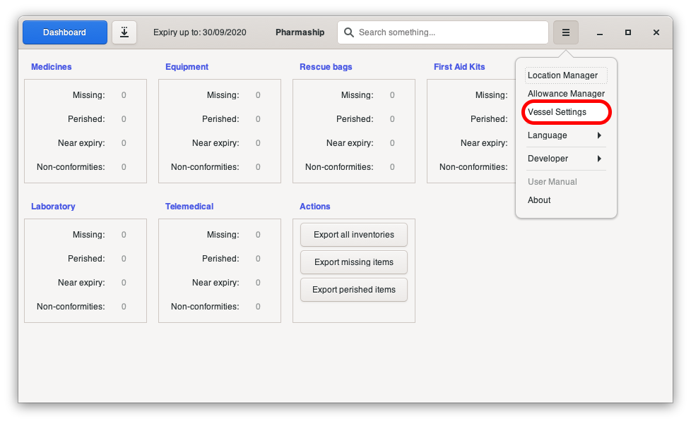
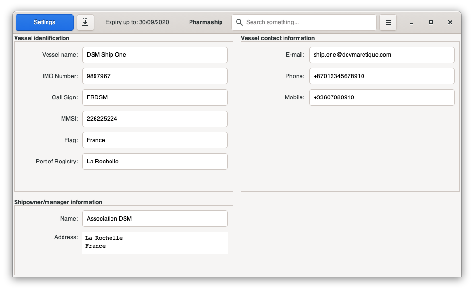

Configure your vessel
=====================

In any software window, open *Configuration Menu* then *Vessel Settings*.

Fill all fields there as it will be used on various area, such as your pdf exportation.
When modifying any value, bottom bar will appear with *save* or *cancel* button.
Click on *save* to record your changes.
