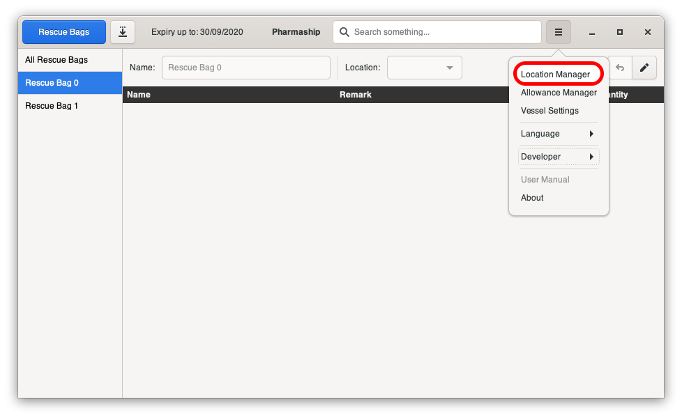
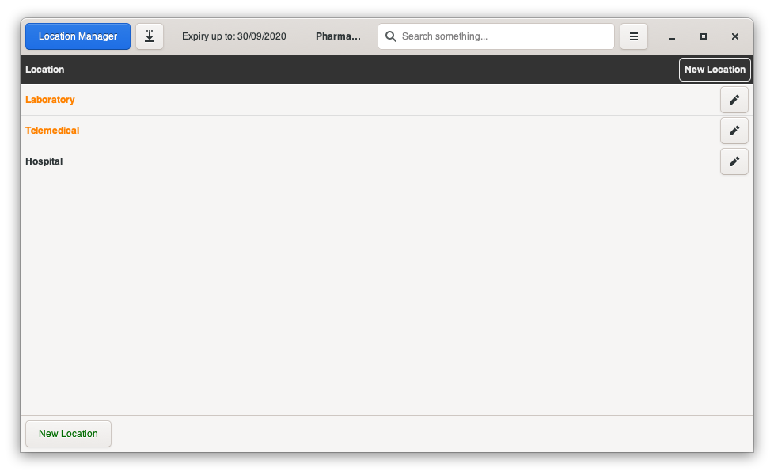
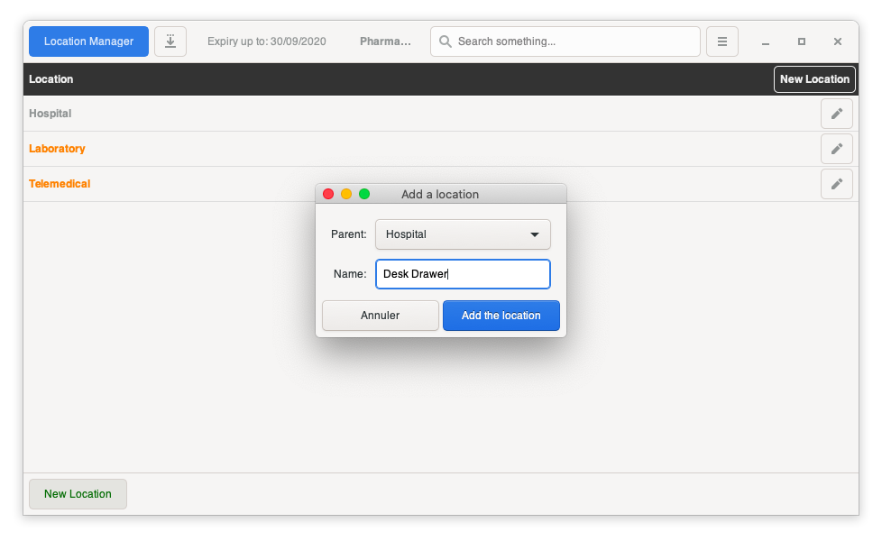
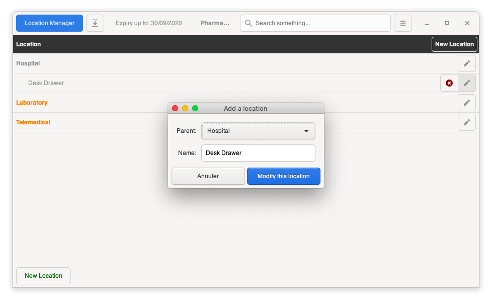
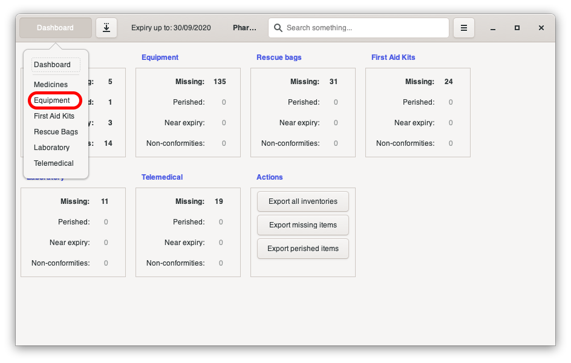
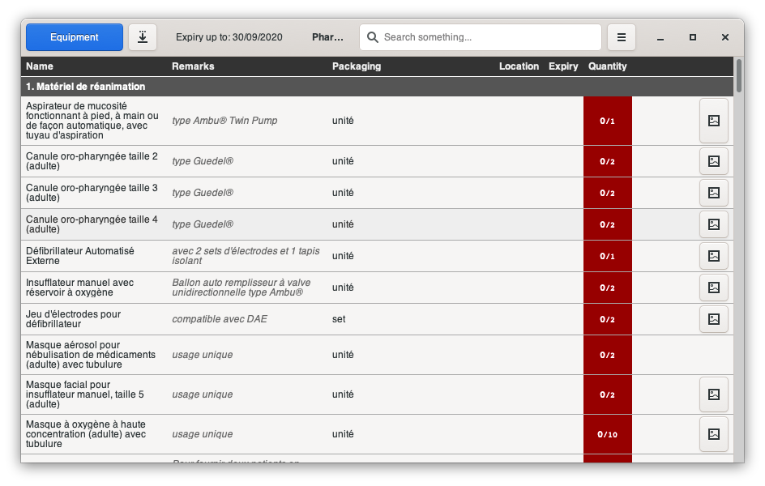
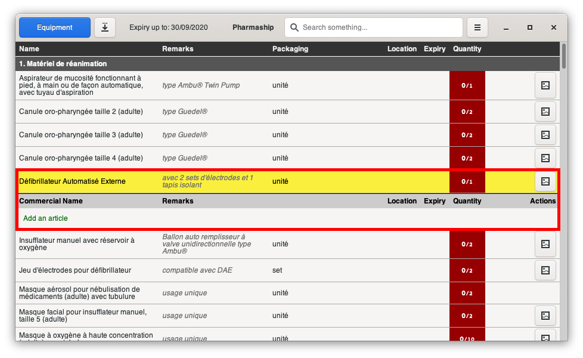
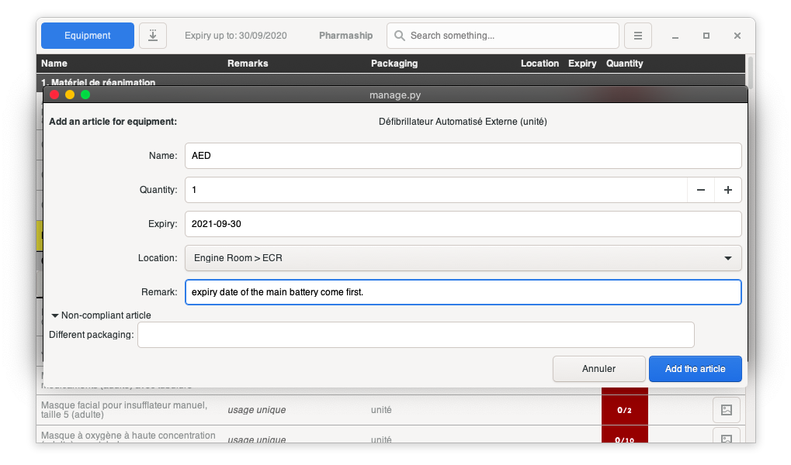
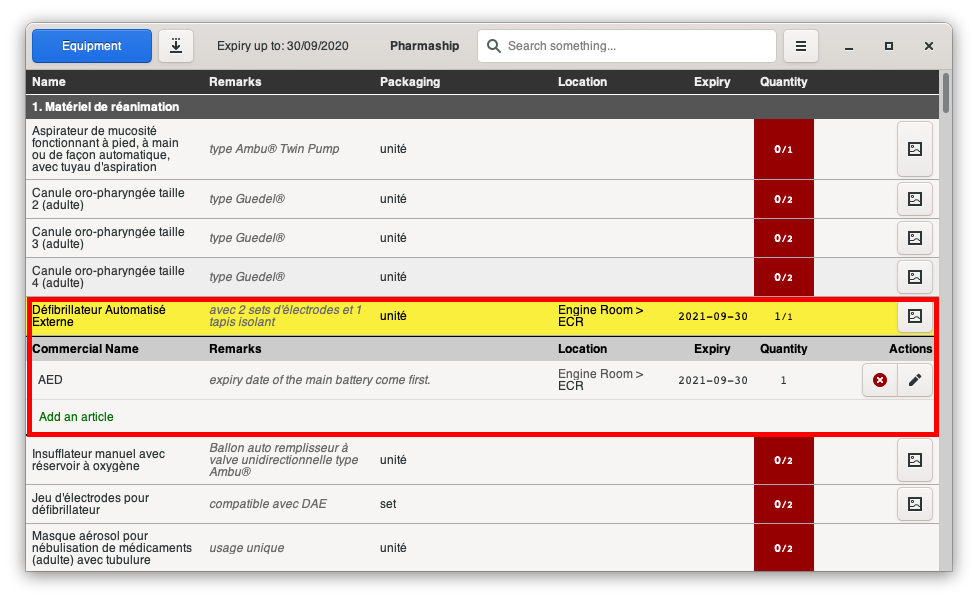
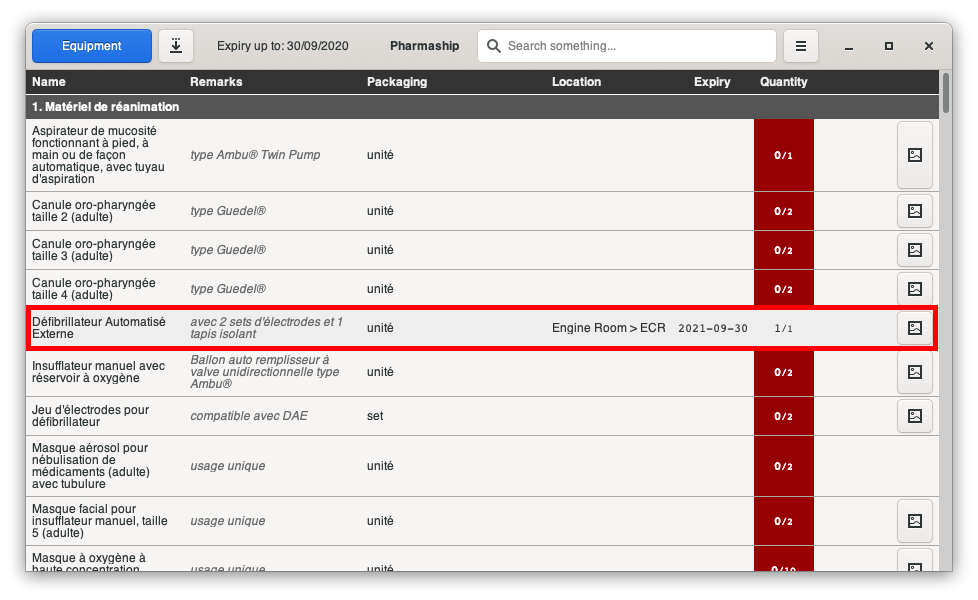

Setup your inventory
--------------------

When you install from scratch, and need to configure your database, before entering any medicines in there, you first
need to configure your location, the shelve and drawer names you will use to tell to pharmaship where are stored your medical stuffs.

.. note:: Be explicit there as finding medicines is always a kind of rush.

Configure your locations
~~~~~~~~~~~~~~~~~~~~~~~~

In any software window, open *Configuration Menu* then *Location Manager*.

By default, there is few locations. You may modify, add, remove others location, but it is a good habit to keep these first locations.

Let's make an example. If we want to add the desktop drawer in our list of locations, because we store medical tools
there, simply click on *new location* button, located either in the top right corner, either in the bottom left corner
of the window. On the sub window which opens, select **hospital** as *parent* location, for a drawer in hospital, and
put a name, like **Desk Drawer**. Click on *Add the location*.

Now it has been added, you can see that it appears in the list of locations - lucky we are !
We can easily delete, or modify it with the button on the right end of its line, and to update, it appears exactly on
the same way. To erase, click on the cross button, then validate on the sub window.

Once all your locations are set up, you may proceed with updates of medicines.

Initial inventory
~~~~~~~~~~~~~~~~~

Well, this might not be the funniest part, but new software for maintaining stock, and managing requisition, often
means complete new inventory. So, here we are. It's time.

Let's make a step by step example. To Update *equipment* first, let's go into its page.

In any software window, click on the blue button, whatever it says, then *Equipment*.

As there is no equipment already setup, you should arrive on the following page, showing an empty list of equipment.
Equipments are coming from allowances you inserted during configuration step.

When clicking on one line, it opens the named equipment inventory list as per below.

To add an item, click on *add an article*. It will open the following sub-window.

.. warning:: Shall an equipment be non compliant, it should be for a packaging issue. In the bottom of the window, you can comment the non compliant reason. For medicines, it can be molecules, or concentration issue, but you will be able to specify too.

Once your article is filled correctly, click on *add the article*. You can see below your article is registered.

Shall you click again on the line title (in yellow), it will reduce it, and you will see that there is location, expiry
date and quantity which change.

Do the same for all your equipment and medicines... Then you may proceed to backup menu, in order to avoid having doing
it again! :-)
