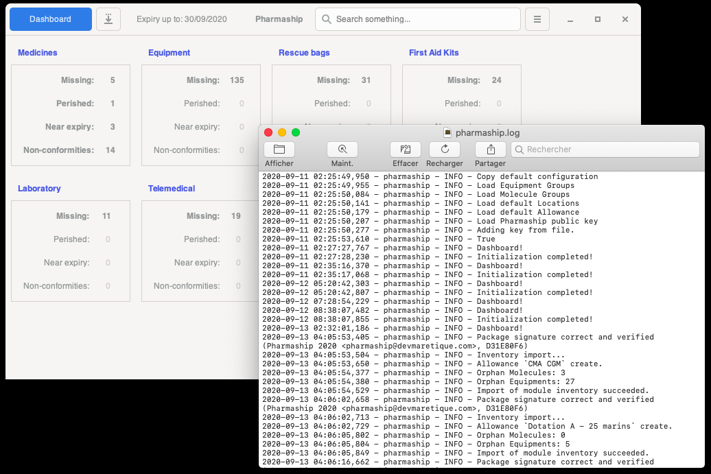
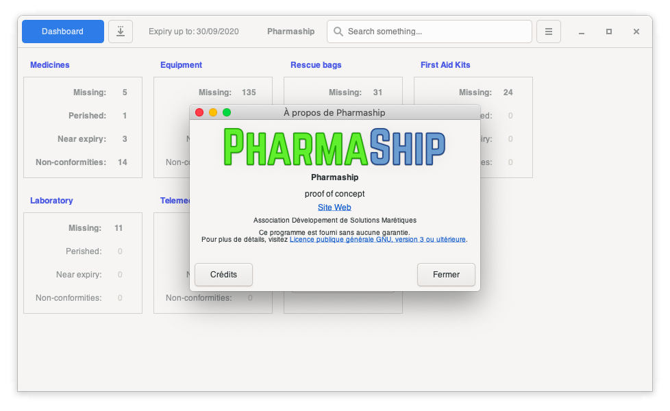

Any trouble
-----------

Shall you encounter any trouble with Pharmaship, please do report to your IT manager, or to your contact in DSM.
Try to provide as much information as possible to explain the situation you encountered.
Screenshots are more than welcome.
You may even zip the  pharmaship datauser folder which is in your home folder.
Depending on you system, location may change from *user/data/pharmaship* under Windows OS to */home/user/.pharmaship* under Linux or MacOs systems..

Open log
~~~~~~~~

In complement of information, please do export also a log of application is possible, from *Developer/Open log* menu.

Kindly note that our log does not contain any personal information.

About
~~~~~

In any case, if you have no contact available, you can use about window, and conect to our website there.
It will redirect you and you will find a contact information there.

Our utmost general address where we can be informed about your trouble is `DSM Contact <mailto:contact@devmaretique.com>`_.

Thank you.
