Daily use of Pharmaship
-----------------------

The goal of *Pharmaship* is to be able to provide a valuable support on managing ship's hospital inventory.
It means :

* Giving a clear overview of status of medicines/equipments:

  * missing items,
  * outdated ones,
  * non-conformities with regulation.

* Assisting in requisition making, by taking into consideration:

  * time before delivery,
  * time for the next order.

* Assisting creating various logs, like

  * medicines / material log,
  * expired medicines list.

We will see in this page, how it works and how to use it properly. Not all of the menu / functionality will be
introduced there, but we are sure that due to its user-friendly interface, you will be able to find all the shortcuts
and other operations not explicitly described in this manual.

Set the expiry date
~~~~~~~~~~~~~~~~~~~

*Expiry up to* as mention in the title bar is always shown. This is a very important parameter in *Pharmaship* as
perished item (in *Dashboard*) or expiry colour coding in pages like *Medicines* are taken from there. Different uses
may be done.

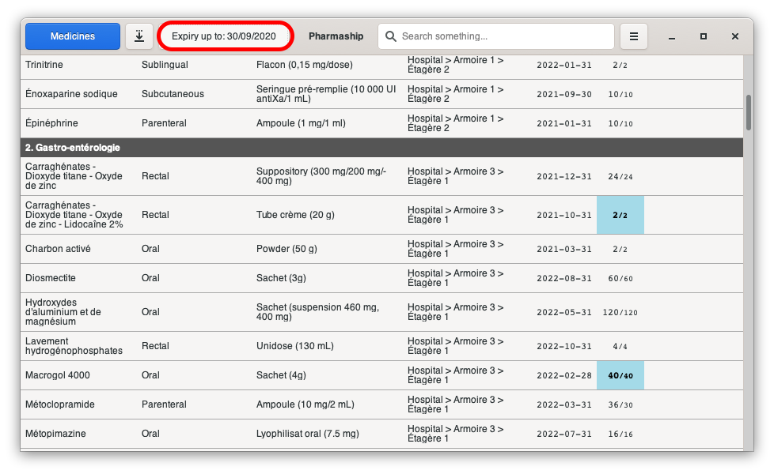

The date which has to be entered there is the date where you want to check what medicines/materials will be expire, in
order to reorder them, or in order to remove them from your medical lockers.

Color coding
~~~~~~~~~~~~~

Colors code is as simple as 3 colors on 2 columns are sufficients for a graphical view.

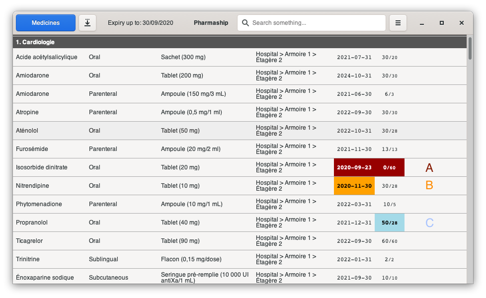

A - Color in red
++++++++++++++++

**Red color** on *Expiry* column means the date of expiry of items on the line is already expired, due to the *Expiry
up to* filed.

If there is **red color** on *Quantity* column, that means you do not have any sufficient quantity onboard at this date,
but, shall you have more that one items (for example, boxes with another expiry date), you may still have the good
quantity, and there is no color in that case.

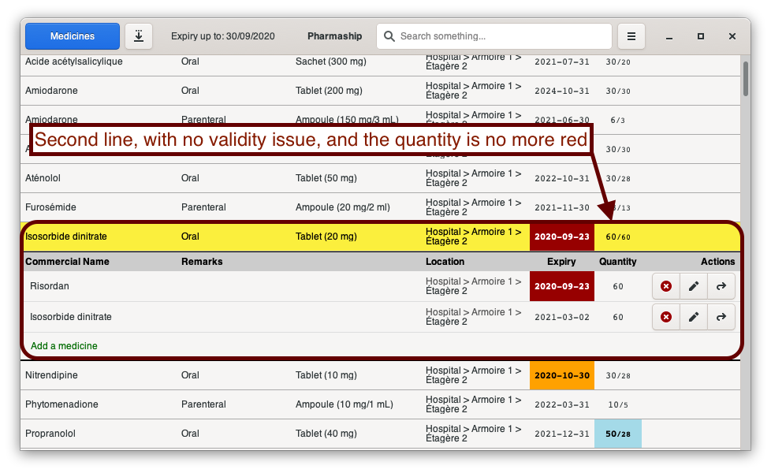

B - Color in orange
+++++++++++++++++++

**Orange color** on *Expiry* column means the date of expiry of items on the line is not already expired, but will
expire at the date composed with *Expiry up to* date + *Warning delay for expiry check* from *Allowance Manager*.

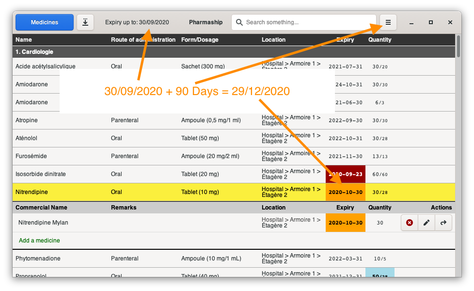

There is no *Orange color* on *Quantity* column, meaning there is no immediate way to know if you will still have enough
items, but as we will see in Generate requisition below, it will be re-ordered.

C - Color in blue
+++++++++++++++++

**Blue color** on *Quantity* column means this item has any kind of non-conformity and has to be re-ordered in order to
be compliant with regulation.

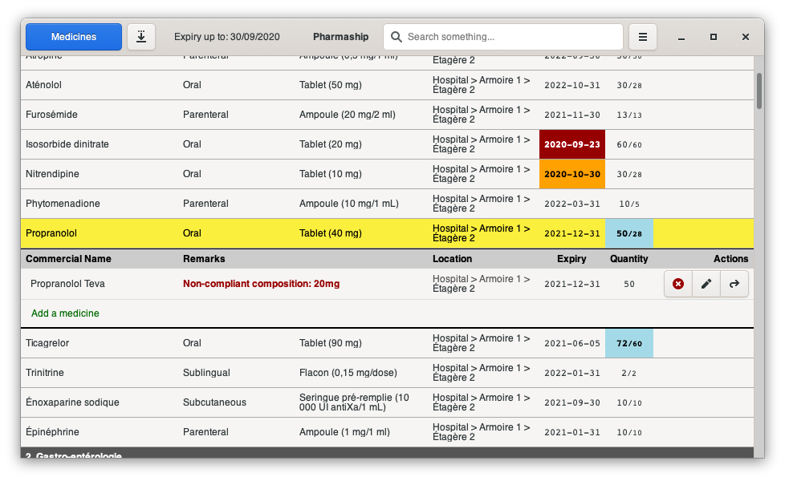

Generate requisition
~~~~~~~~~~~~~~~~~~~~

In order to generate a good requisition, it is from utmost importance to well understand how to setup dates properly,
especially *Expiry up to* and *Warning delay for expiry check*.

*Expiry up to* is the date where you are suppose to receive your next requisition (the one you are preparing now).

*Warning delay for expiry check* is the delay between 2 requisitions. 90 days, for 3 months for instance.

That means, today (May 15th), I prepare the requisition to be received by the end of the month (May 30th).
*Expiry up to* date is set to May 30th.

My interval between 2 requisitions is 2 months. So, next requisition will be received on July 30th.
*Warning delay for expiry check* has to be set to 60 days.

By this way, I will order all medicines that will expire until May 30th + 60 days => July 30th.
And during month of July, I will be able to order for the 2 next months again...

From the page *Dashboard*, click on the down direction arrow in order to generate a full inventory of your hospital
items. You may send this list to your medical locker contractor, and he will prepare you a requisition with only missing
items.

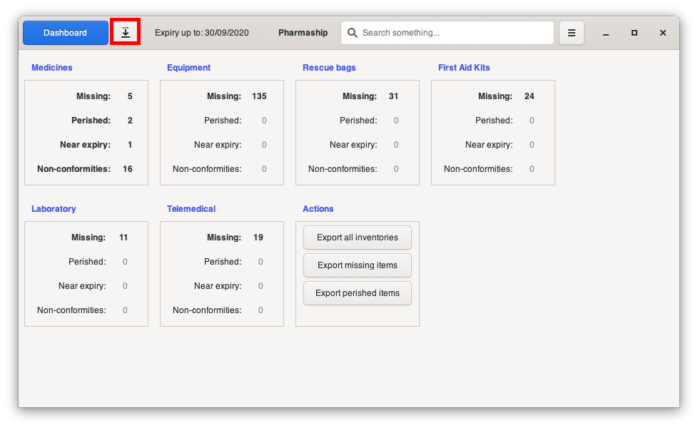

Generate inventory
~~~~~~~~~~~~~~~~~~

Several inventories can be generated from the software. From any specific page, you may generate dedicated inventory.
For example, if you are on *First Aid Kits* page, you will generate a inventory of First Aid Boxes only. Here below how
it looks.

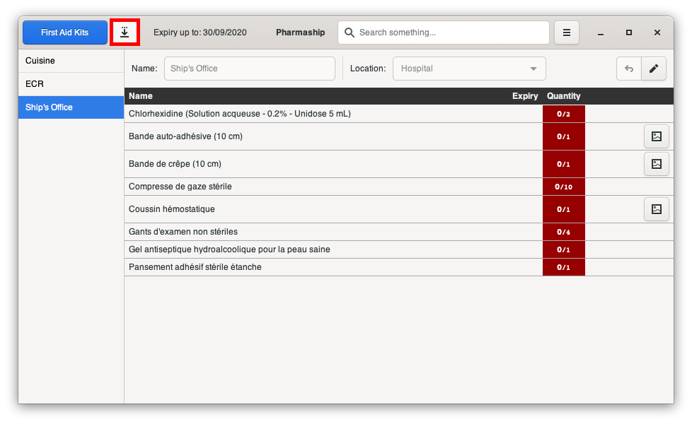

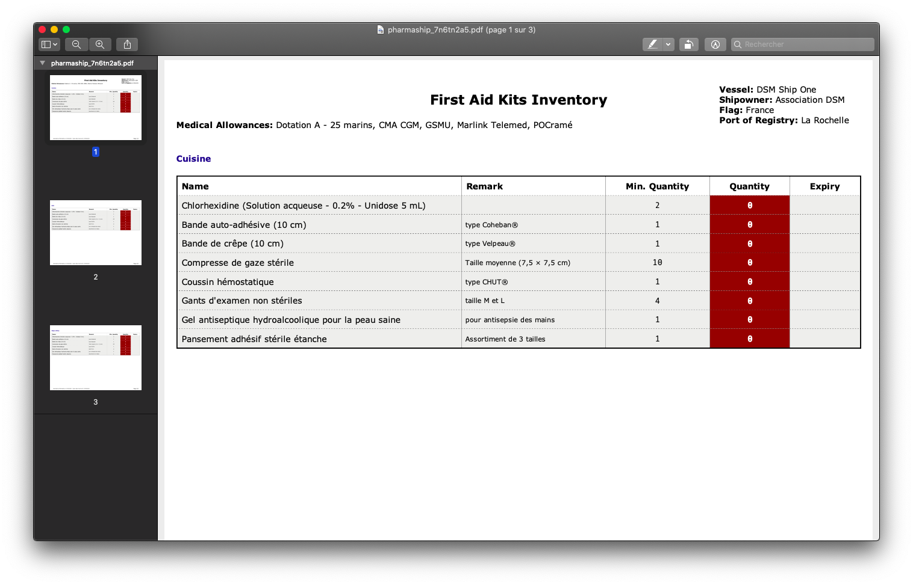

Take out items
~~~~~~~~~~~~~~

In order to manage smoothly your stock, without having to make full inventory every time, a good way to do is to record
every single take out of medicine / material every time you do it.

To do so, goes on the item you want to remove. Click on the most right button. On the sub-window which opens, edit the
quantity you take out, and press *Use it!* button.

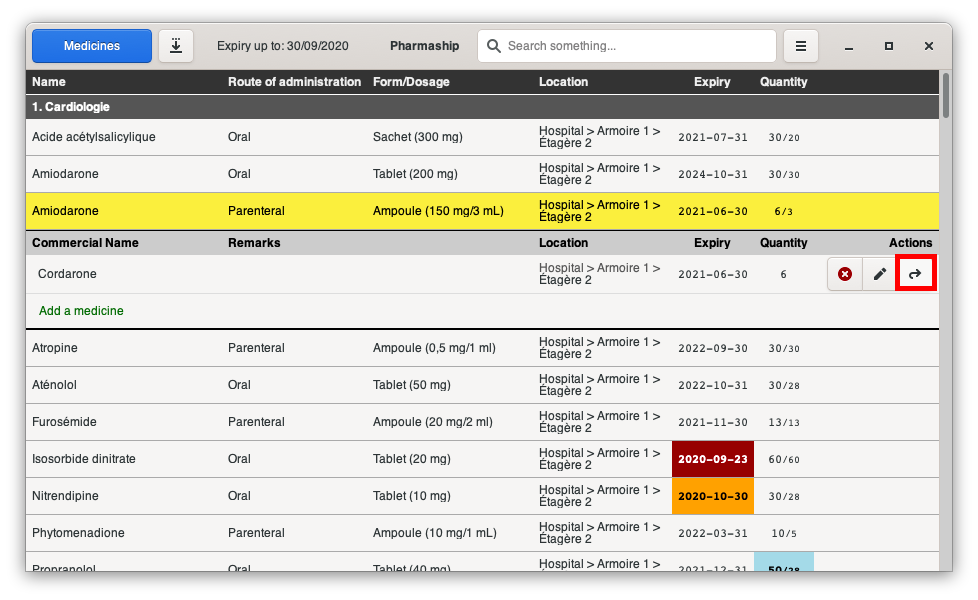

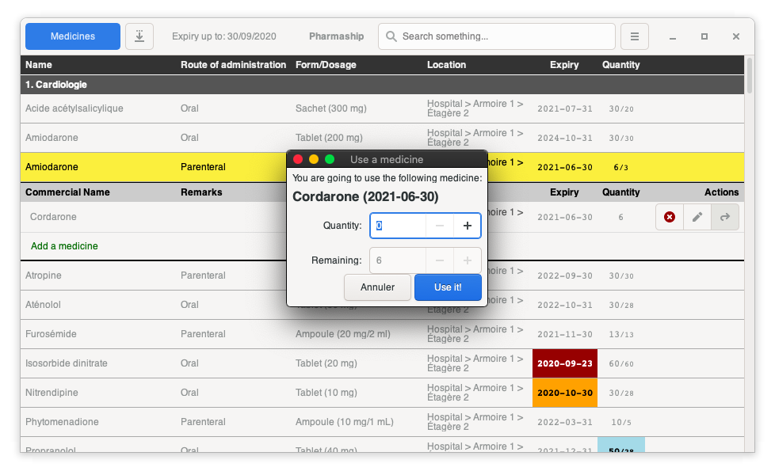

Update inventory
~~~~~~~~~~~~~~~~

In order to update your inventory, it is as simple as making it again. Just go page after page in the menu :

* Medicines
* Material
* ...

and when clicking on the modif button, it will open the modification sub window where you can modify whatever you want
and save your changes.

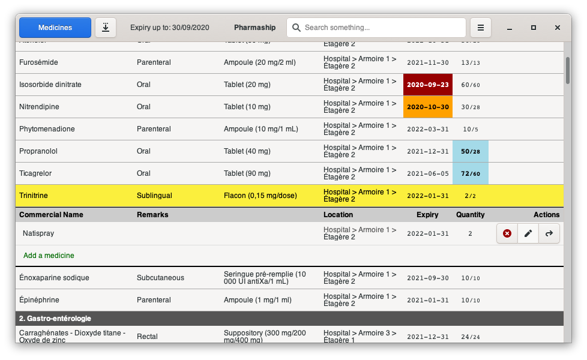

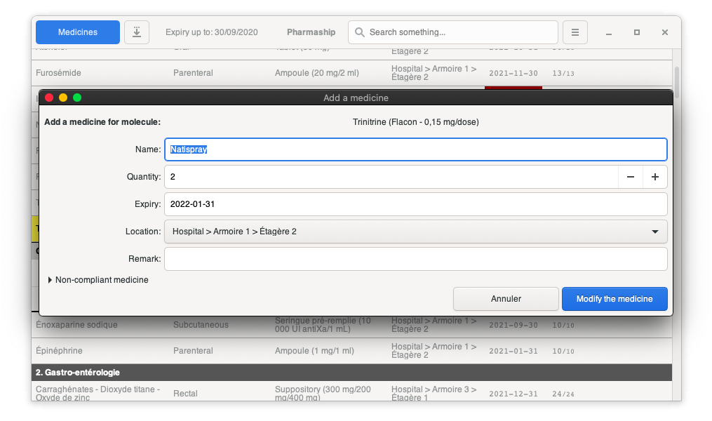

Search functionality
~~~~~~~~~~~~~~~~~~~~

One of the most advance functionality is the "search function". In the top bar, put some letters of whatever you search
medicine or material, and click to [enter]. Whereever it is recorded in molécule / commercial name / item / ... it will
be found out of there.

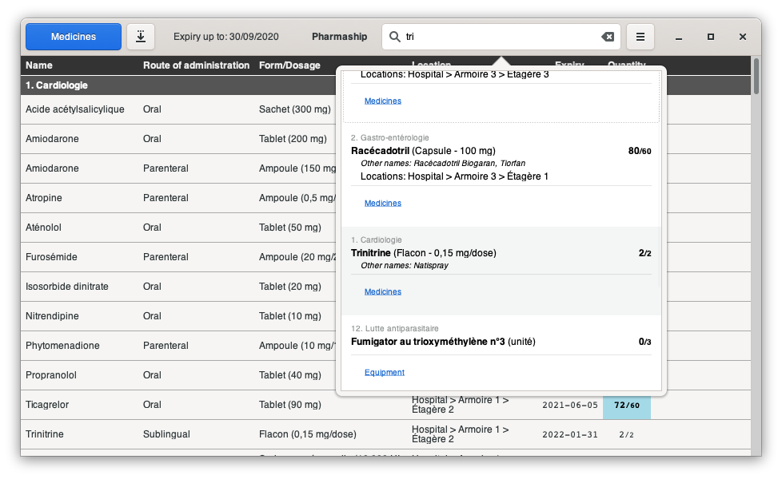

Dashboard
~~~~~~~~~

Functions from the main page, called *Dashboard*, are numerous. You may do:

* a full inventory export, using the button *Export all inventories*.
* an dedicated export of all missing or perished items.

.. Note:: Perished items inventory is usefull to remove from locker whwat is perished at the current date for example.

But you can do even more than that. As you may noticed already, all table name are clickable, this is a shortcut where
its related page. Every single number displayed there is clickable also. It offers you the possibility to see all
detailled information about items included in this number.

For exemple Perished medicines contains 2 items

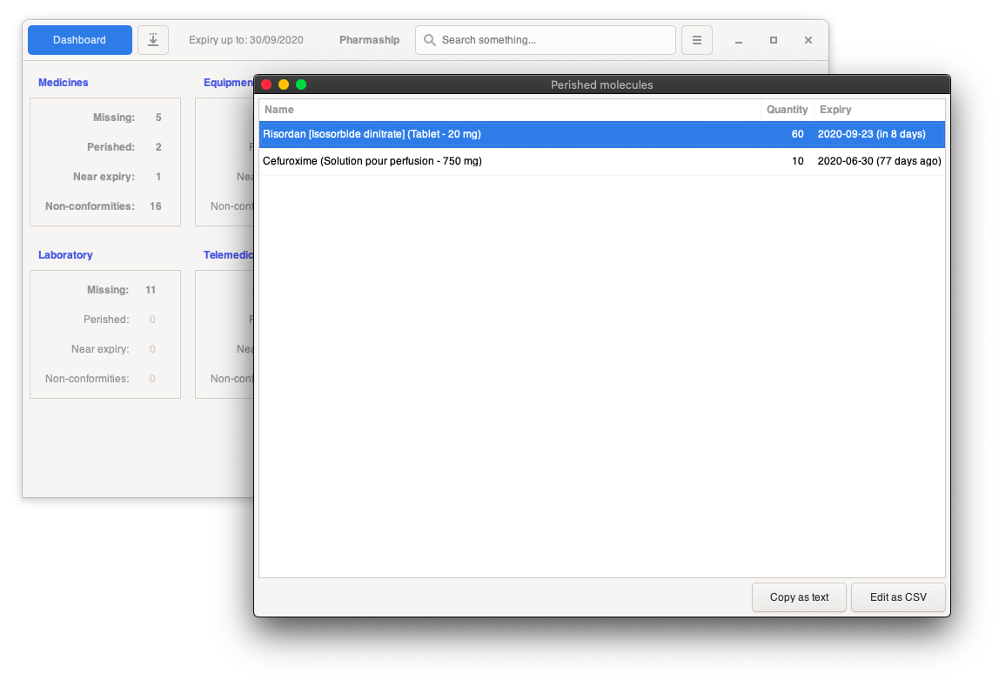

And as you can see, you may copy the result as txt (Text format) or you may export the result in csv to make a table
or manual changes.