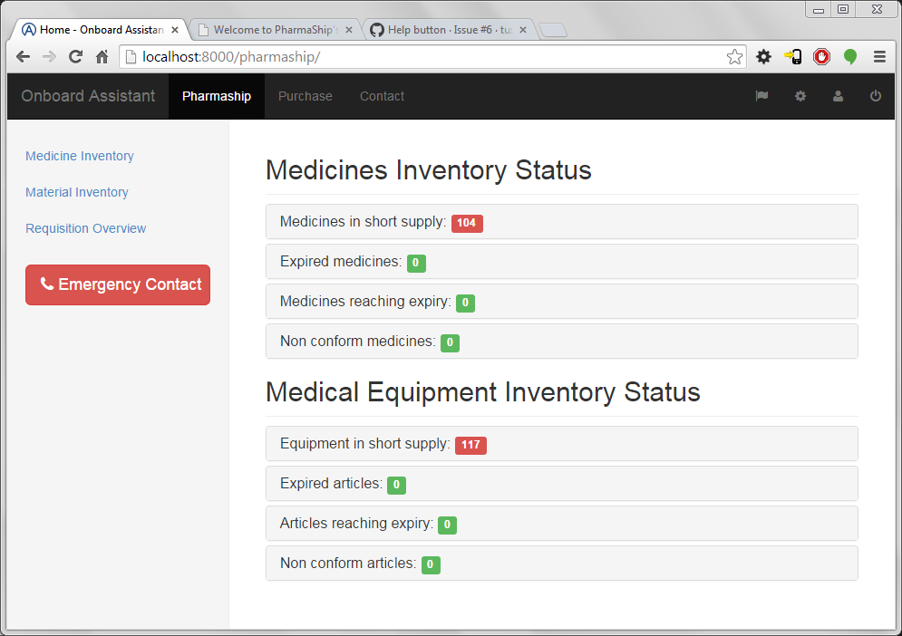
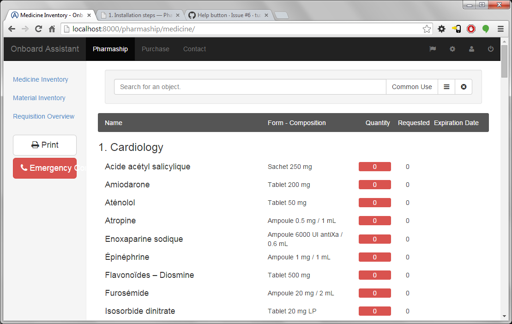
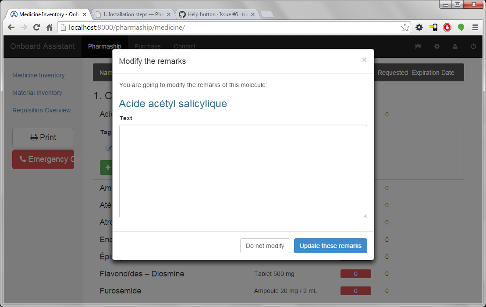
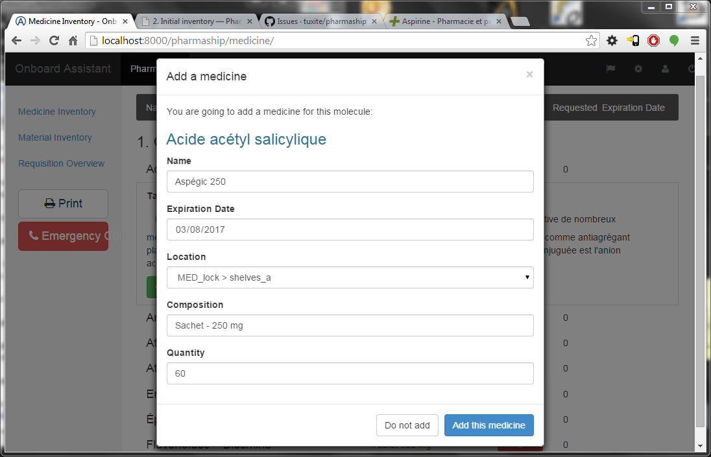
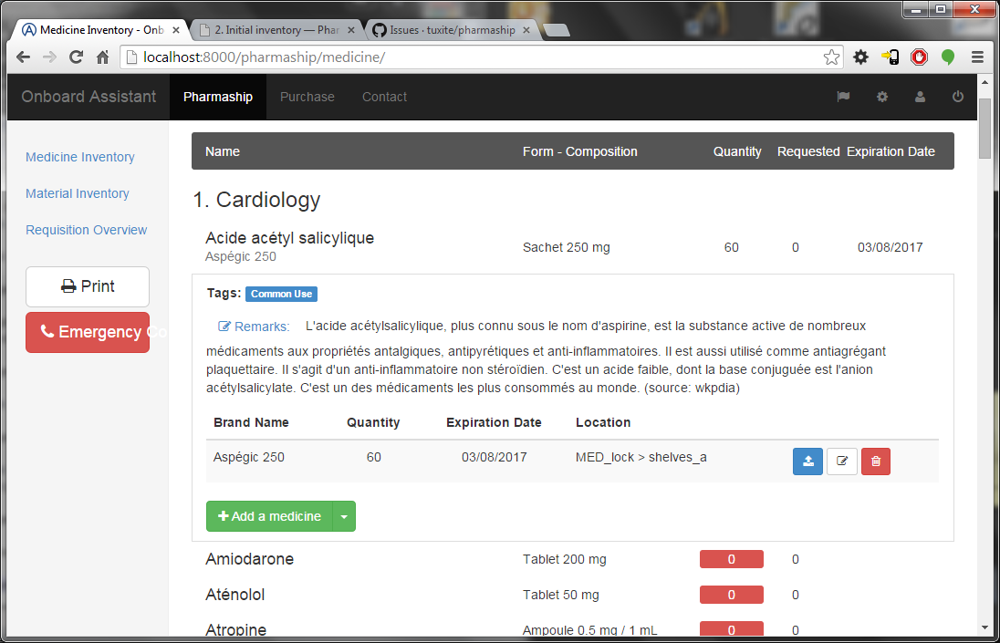
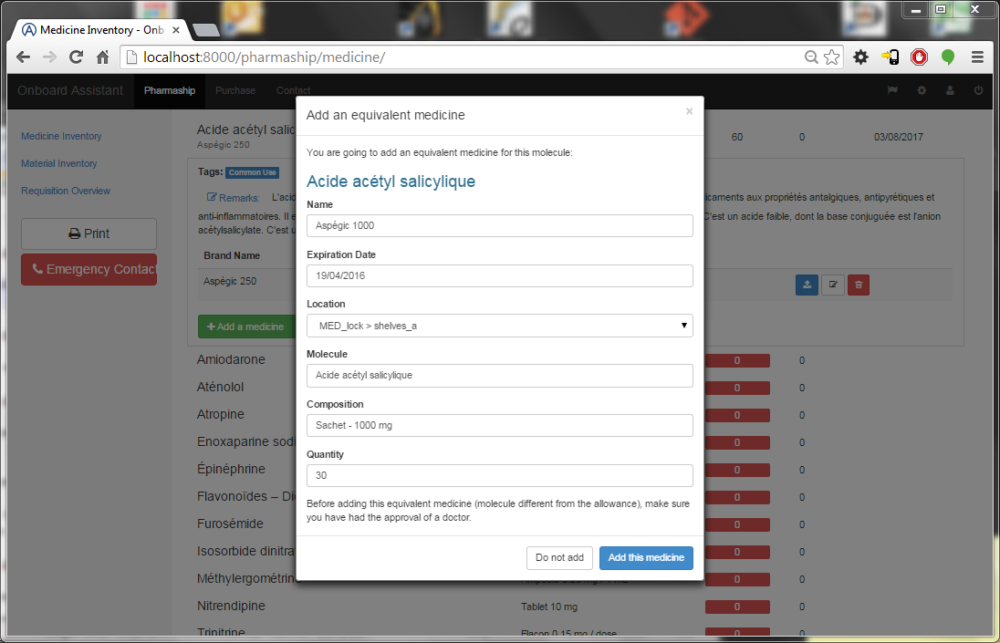
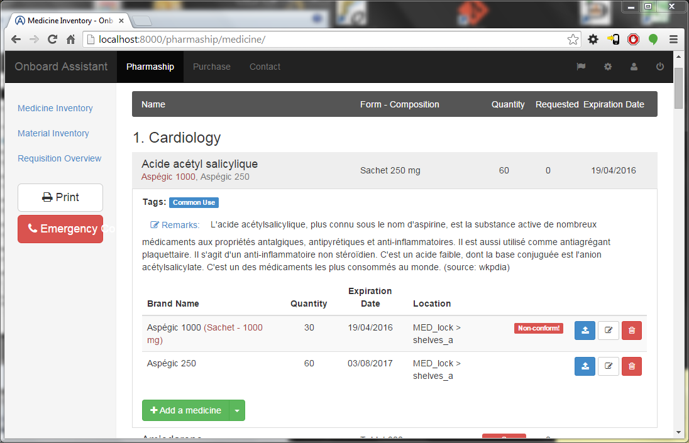

.. |ps| replace:: *PharmaShip*

*****************
Initial inventory
*****************

In most of the case, you won't have wait this software does exist to start to manage you medicines... Unfortunately, to get |ps| working fine, you will have to initialize it with a full inventory of your stock.

Once you done every steps of Chapter 1, especially setting up all the locations where you store molecules and/or material, you should click on Pharmaship in the top bar menu.

There you will find a summary of your inventory according to the allowance(s) you enable previously.

As you figured out, all is empty, and you could even click on ``medicine in short supply`` to develop. But we will see this on a further chapter...

Instead of that, click on ``Medicine Inventory`` on the left menu bar, you will arrived on the following window:

You might now click on each molecule line (ie: ``Acide acétyl salicylique`` in order to develop it at to add medicines & remarks.

.. image:: img/inventory1.png

* Click on ``Remarks`` to add any remark concerning that molecule, if any (then apply or discard your changes).

* Click on ``Add a medicine`` to add a new medicine to a molecule. Fill name, expiration date, shelve, composition & quantity, then validate.

You should then arrive on the inventory page like that one, we will see how to use those new three buttons that appeared on the right line of the new medicine, once we finished the inventory:

By Clicking on the arrow close to ``Add a medicine`` you might also ``Add an equivalent``. The main difference, as shown below is the fact that you have to enter the exact molecule of this equivalent. An equivalent medicine might be as well the same molecule, but at an other composition.
 

 
By doing so, you will find a new line in your inventory - as shown in image below - with the equivalent added. But, there, please note that :
* there is a "non-conform!" label raised;
* in our example, composition is the non-valid part, so it appears in red;
* finally, as you may already have notice, quantity in inventory (or inventory summary) did not updated as that medicine is not a valid one.

Once this is done, you might continue filling all your inventory: medicines as well as materials.
