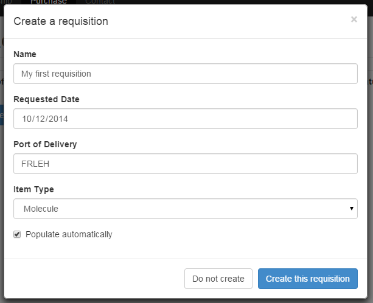
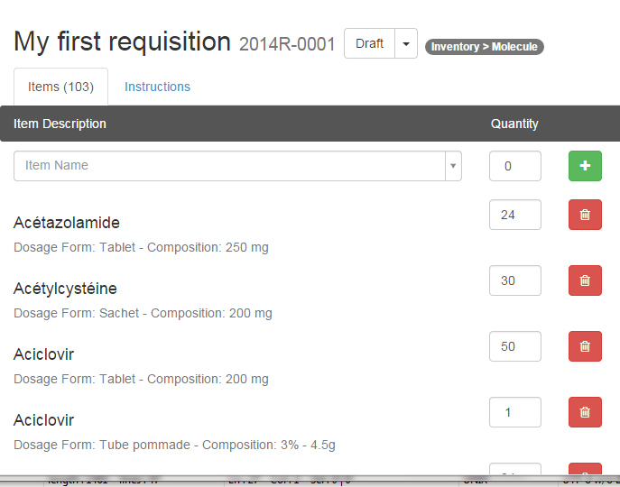
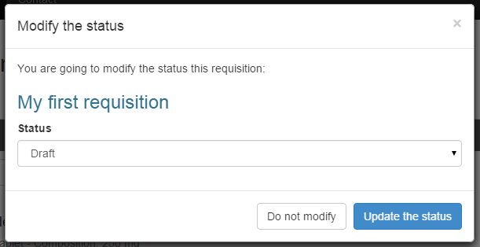
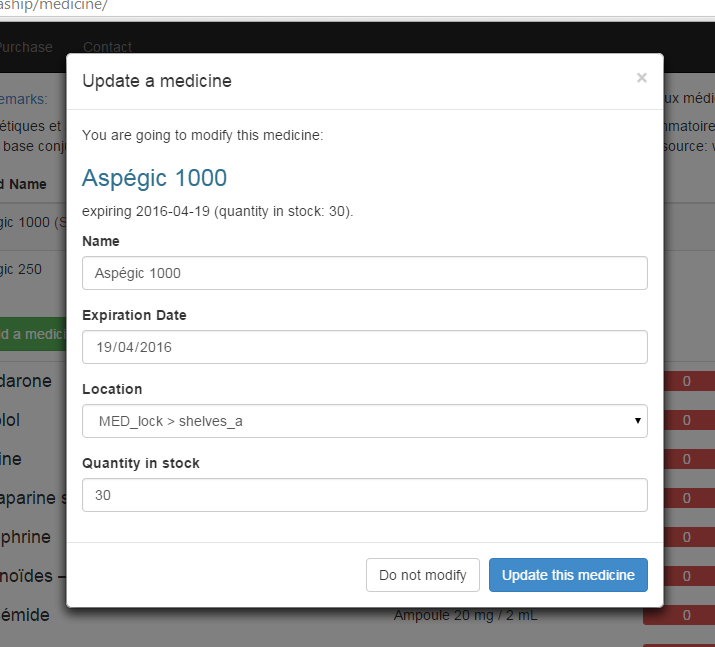
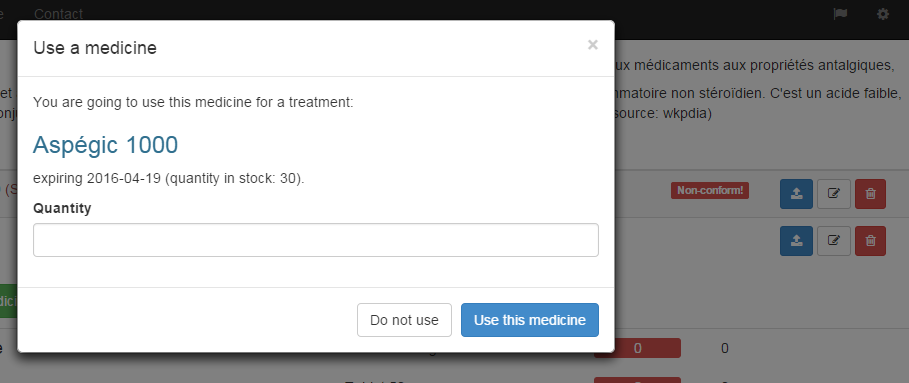

***********
Requisition
***********

Requisition overview
====================

That page opens an other Onboard Assistant module, the purchase one. In that module - so far - you can manage Pharmaship requisition(s) by creating, editing and deleting ones. Empty after the installation process, we will create our first requisition.

New Requisition
===============

Once you complete your inventory, you should create your first requisition. That is an important point to fulfil the inventory before to prepare the first requisition, as we will use the "populate function".

By clicking on the "new requisition" button, you will access to the following window:

There, you have to fill the requisition name, the date where you want to receive your requisition as well as the port of delivery. There you can use as well a port code on 5 characters, or a full name of the port. There is no verification at that step (follow your company procedure).

Finally, choose the range of application of your requisition: molecule or equipment. And choose "Populate automatically", in order for Pharmaship to find the molecule or the equipment missing in your stock inventory compared to the allowance needed by regulation.

Now, click on "create" and wait... as shown below, this will generate the requisition with all quantity missing in regard to your stock and expiry dates.

On that window, you can find:

* the requisition title,
* its reference code,
* the status of the requisition,
* and the type of requisition (there, it is molecule requisition).

Below, you have two tabs: items and instructions. Instructions is the tab where you might instruct your purchaser about what you are exactly asking for.

Then on items tab, you have a text-box where you can search or just add new items, quantity and then validate. It will be added at the end of your requisition.

Also, line by line, you can modify the quantity or delete the line. This is confirmed by a green tick, on the right side of the delete button as soon as you quit the quantity box.

Once your requisition is ready, you might go back to Requisition Overview, and you will find a short resume of your newly added requisition. In order to re-open it, just click on the eye.

Additional note: As you can see, there is a print button, allow you to print the requisition and when you receive it, to write on it the quantity of medicine received... (See below how to update your stock.)

Requisition Status
==================

When you want to update the status of a requisition, you have to re-open it, then close to its reference, you might select the status you want to drop this requisition to.

On this button, you might click on the name (left side) what will show you that following screen, where you could change the requisition status.

Or you might click on the right side, where you can:

* change the status - same window as previously,
* change name of requisition,
* or delete the requisition.

The different status are:

* Draft - only for local requisition, when working on it.
* Pending approval - when draft is ready, but requisition is not yet approved. At that stage, it is still possible to re-edit it if needed.
* Approved - when approved, there is only the possibility to cancel it.
* Quoted - when you received the quotation.
* Ordered - when requisition has been ordered (quotation approved).
* Partially received - if you received only some parts from that requisition.
* Fully received - all is received.
* Cancelled - if you have to cancel the requisition after it has been approved (not to delete it).

Please note that on this version of Pharmaship, whatever is the status, there is no change in your inventory. In other terms, even if you mark a requisition as fully received, you still have to update manually your stock.

Update/Modify items
===================

Once you print the requisition and inventoried what you received on board, you might change the status to "partially received" or "fully received" ; and then change the current page to "Medicine inventory" or "Material inventory".

Open the molecule where you want to add a medicine.
and on the right side, click on the middle button: "Edit this medicine".

There you can modify data from this medicine, as well as its quantity.

Consumption of items
^^^^^^^^^^^^^^^^^^^^

In case that you have to consume some medicine, do not update the stock as above but click on the blue button instead of.
That button called "use this medicine" will open the following sub window, where you just have to enter the number of medicine you used:

Remove items
^^^^^^^^^^^^
 
The last icon there - the red one - is to delete completely the medicine. This should be done if the medicine is outdated for example.

At that stage, you are able to install Pharmaship, to set it up, to fill Pharmaship inventory and to make a requisition, and finally you know how to update your stock in the software database when you receive it.

The next chapter will show you how to add another allowance.